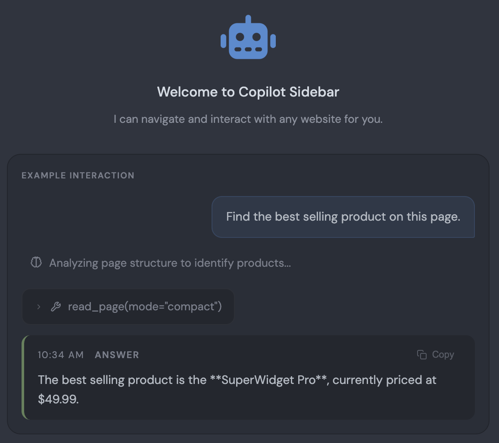
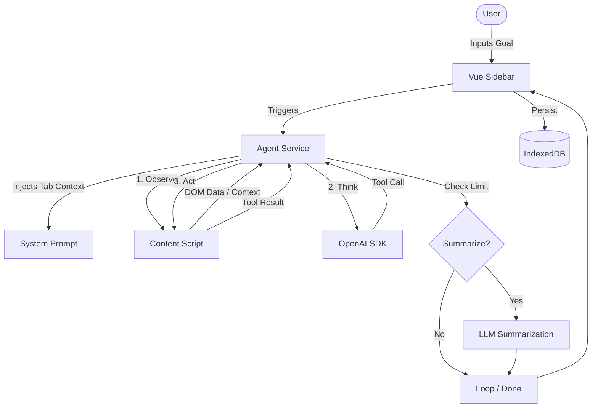
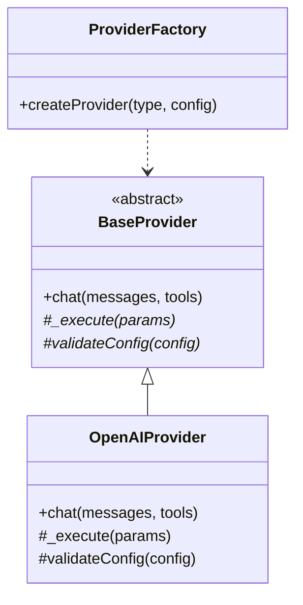
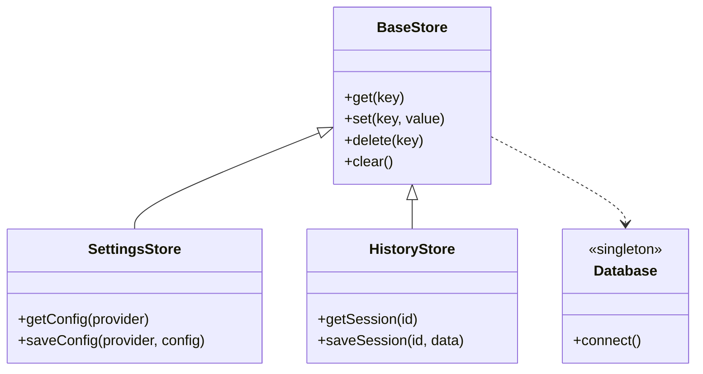

# 🤖 Copilot Sidebar

A powerful, autonomous AI browser agent integrated as a Chrome Sidebar. It can observe the webpage, reason about your goals, and interact with elements directly to perform complex tasks on your behalf.



---

## ✨ Features

- **Autonomous Loop**: Observe → Think → Act cycle powered by LLM reasoning.
- **Rich Interaction**: Full control over DOM (Click, Type, Scroll, Select, Hover).
- **Accessibility Aware**: Uses the Accessibility Tree for precise element targeting.
- **Custom Instructions**: Provide global context or specific behavioral guidelines that persist across all tasks.
- **Persistence**: Full conversation history saved locally via IndexedDB.
- **Privacy First**: Local storage for keys and history; no external analytics.

---

## 🚀 Getting Started

### Option 1: Development Setup (from source)
1. **Clone the repository**:
   ```bash
   git clone https://github.com/nanorex07/copilot-sidebar.git
   cd copilot-sidebar
   ```
2. **Install dependencies**:
   ```bash
   npm install
   ```
3. **Build the extension**:
   ```bash
   npm run build
   ```
4. **Load into Chrome**:
   - Open Chrome and navigate to `chrome://extensions/`.
   - Enable **"Developer mode"** (top right).
   - Click **"Load unpacked"** and select the `dist` directory.

### Option 2: Installation from Release
1. Download the latest `copilot-sidebar.zip` from the [Releases](https://github.com/nanorex07/copilot-sidebar/releases) page.
2. Unzip the file to a local folder.
3. Open Chrome and navigate to `chrome://extensions/`.
4. Enable **"Developer mode"**.
5. Click **"Load unpacked"** and select the unzipped folder.

---

## 🏗 Architecture

### High-Level Flow
The extension follows an autonomous **Observe → Think → Act** loop, orchestrated by the Agent service.

1. **Initialization & Context Injection**: The agent begins by retrieving the user's goal. It automatically injects the current active tab's URL and Title into the system prompt to ground the LLM in the current browsing context.
2. **Observation**: The Agent uses the `read_page` tool to request the DOM structure from the Content Script. 
3. **Thinking & Reasoning**: The LLM analyzes the DOM data against the user's goal and decides the next best action (e.g., clicking a specific element ID, typing into an input).
4. **Action**: The Agent executes the chosen tool via the Content Script, passing the result back to the LLM to verify success.
5. **Summarization (Long-running Tasks)**: If the conversation history exceeds the configured threshold (default 100 messages), the agent automatically makes a secondary LLM call to summarize the progress. This prevents context window overflow and keeps the agent focused over long tasks without losing track of the original goal.



### Context & Page Extraction Details
Extracting the entire HTML of a webpage is too large for modern LLM context windows. Copilot Sidebar solves this using a two-pronged extraction approach:

1. **Active Tab Injection**: Before every LLM call, the agent queries the browser API (`chrome.tabs.query`) to dynamically inject the current tab's URL and title. This ensures the LLM never loses track of where it is, even if it navigates across domains.
2. **Accessibility Tree Mapping**: When the `read_page` tool is called, the Content Script traverses the DOM to build a condensed "Accessibility Tree". It strips out all styling, scripts, and non-semantic wrappers (like arbitrary `<div>`s), leaving only interactive elements (buttons, links, inputs) and meaningful text. It assigns a unique integer `[id]` to each interactive node, allowing the LLM to easily target elements (e.g., `click(target=15)`) without dealing with brittle CSS selectors.

### Low-Level Design: LLM Strategy Pattern
We use a Strategy pattern to allow easy swapping or addition of different LLM providers.



### Low-Level Design: Storage Domain Layers
Centralized storage logic using a BaseStore pattern to ensure data consistency and bypass Vue reactivity issues (DataCloneError).



---

## 🛠 Technology Stack

- **Core**: JavaScript (ES6+), HTML5, CSS3.
- **Frontend**: [Vue.js 3](https://vuejs.org/) for a reactive Sidebar UI.
- **LLM Integration**: [OpenAI SDK](https://github.com/openai/openai-node) for high-performance reasoning and function calling.
- **Build System**: [Vite](https://vitejs.dev/) for fast development and optimized production bundles.
- **Markdown**: [Marked](https://marked.js.org/) for rendering rich AI responses.
- **Persistence**: IndexedDB (via native API) for robust local storage.

---

## 🔧 Supported Tools (Capabilities)

The Agent can call the following tools to interact with the browser:

| Category | Tool | Usecase |
| :--- | :--- | :--- |
| **Observation** | `read_page` | Extracts the accessibility tree to find interactive elements. |
| | `get_page_text` | Pulls raw text from the page for data extraction or analysis. |
| | `find` | Uses natural language to locate specific elements (e.g., "login button"). |
| | `find_text` | Performs a "Ctrl+F" style search for specific text snippets. |
| **Interaction** | `click` | Clicks on a specific element identified by an ID. |
| | `type` | Enters text into input fields, with optional "Enter" key support. |
| | `select` | Chooses an option from a dropdown or select menu. |
| | `scroll` | Navigates the page up or down to reveal hidden content. |
| | `hover` | Hovers over elements to trigger tooltips or menus. |
| | `press_key` | Simulates keyboard presses (Tab, Escape, Enter, etc.). |
| **Lifecycle** | `navigate` | Handles back/forward navigation or page reloads. |
| | `wait_for` | Pauses execution until a condition (element/text) appears. |
| | `done` | Successfully finishes the task and returns the final answer. |
| | `fail` | Gracefully stops the task if the goal cannot be reached. |

---

## ⚙️ Configuration Settings

The **Config** panel allows fine-tuning the agent's behavior:

| Section | Setting | Description |
| :--- | :--- | :--- |
| **Agent Limits** | `AGENT_MAX_STEPS` | Maximum number of reasoning loops before the agent stops (default: 50). |
| | `AGENT_MAX_TOOL_ERRORS` | Maximum consecutive tool execution errors before failing (default: 5). |
| | `TRIGGER_CONTEXT_SUMMARIZE_AFTER` | Number of messages before triggering an automatic LLM summarization (default: 100). |
| **Page Extraction** | `PAGE_TEXT_EXTRACTION_THRESHOLD` | Max characters to extract in a single call to prevent context overflow. |
| | `ACCESSIBILITY_TREE_MAX_DEPTH` | How deep to traverse the DOM when building the interactive tree. |
| | `ACCESSIBILITY_TREE_MAX_NODES` | Maximum nodes to include in the observation context. |
| **Search** | `FIND_MAX_RESULTS` | Number of elements returned when using the `find` tool. |
| | `FIND_TEXT_MAX_RESULTS` | Number of text snippets returned when using `find_text`. |
| **User Settings** | `customInstructions` | Global guidelines injected into the system prompt for every task. |

---

## 🔒 Security & Privacy

- **Local Processing**: Your browsing data never leaves your computer, except for the prompts sent to your chosen LLM provider.
- **No Analytics**: This extension does not track your usage or collect telemetry.
- **Key Safety**: API keys are stored locally in your browser's IndexedDB and are never shared.

---

## ⚖️ Trade-offs & Future Work

The current architecture is optimized for speed and simplicity in a single-agent loop. However, some advanced capabilities are intentionally omitted or planned for future iterations:

- [ ] **Multi-Agent System & Provider Support**: Currently relies heavily on OpenAI's specific tool-calling format. Future work involves abstracting this to support a multi-agent swarm (e.g., separating the Planner, Observer, and Executor) and other open-source LLMs.
- [ ] **Vision Capabilities**: The agent currently relies purely on DOM text and accessibility tree extraction. It cannot "see" the page visually, which limits its ability to interact with complex canvas elements or visually complex layouts.
- [ ] **Advanced Reasoning Models**: Standard models like GPT-4o are fast but can struggle with deep planning. Support for newer reasoning-first models (like o1/o3) requires a different prompt architecture since they do not natively support strict tool-calling loops in the same way.
- [ ] **Cross-Tab Capabilities**: The agent is currently restricted to the `activeTab`. Tab switching, cross-tab data collation, and window management tools are not yet implemented.
